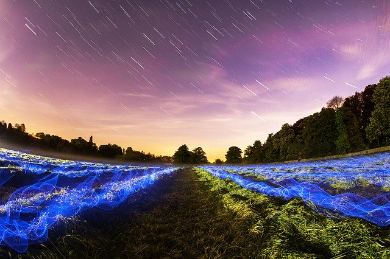

# 🕵️ LSB Steganography in C  
### High-Performance Image Steganography with BMP & PNG Support

A modular **C-based steganography system** that hides encrypted messages inside images using **Least Significant Bit (LSB)** manipulation with precise bit-level control and correct handling of real-world image formats.

---

## 🚀 Demo

```bash
./stego encode test_images/test1.bmp outputs/out.bmp "hello lokesh" key
./stego decode outputs/out.bmp key

Output:

BMP Encoded Successfully
Extracted length: 12
Decoded: hello lokesh

📸 Visual Proof

### Original Image


### Encoded Image



👉 Images appear identical — hidden data is invisible to the human eye.

⚙️ Features

🔐 Encrypted payload embedding (XOR-based encryption)
🧮 Bit-level LSB encoding & decoding
🖼️ BMP support with correct row padding handling
🧾 PNG support via libpng
🔍 Steganalysis module (basic statistical detection)
⚡ Modular architecture (core, io, security, utils)
🧪 CLI-based interface for encode/decode/analyze


🏗️ Project Structure

LSB-Steganography-C/
│
├── src/
│   ├── core/        # encoding / decoding logic
│   ├── io/          # image handling (BMP, PNG)
│   ├── security/    # encryption module
│   ├── analysis/    # steganalysis
│   └── utils/       # bit manipulation utilities
│
├── include/         # header files
├── test_images/     # sample images
├── outputs/         # generated outputs
├── scripts/         # test scripts
├── docs/            # documentation (optional)
├── Makefile
└── README.md

⚙️ Installation

🐧 Linux / WSL
sudo apt update
sudo apt install build-essential libpng-dev

🔨 Build
make

▶️ Usage

Encode Message
./stego encode input.bmp output.bmp "secret message" key

Decode Message
./stego decode output.bmp key

Analyze Image
./stego analyze output.bmp

🧪 Testing
chmod +x scripts/test.sh
./scripts/test.sh

🧠 Architecture

Encoding Pipeline

Input Image
   ↓
Extract Pixel Data
   ↓
Encrypt Message
   ↓
Embed Length + Data (LSB)
   ↓
Reconstruct Image
   ↓
Stego Image

⚠️ Key Engineering Challenges

1. BMP Row Padding
BMP rows are aligned to 4 bytes
Incorrect handling causes bit misalignment
✅ Solved using row-wise parsing + linear buffer

2. Bit Synchronization
Encoding and decoding must match exactly
Solved using sequential bit indexing

3. Encryption Edge Cases
XOR introduces null bytes
Solved using binary-safe handling (not relying on strlen)

📊 Results

Test Case	Status
Short message	✅
Long message	✅
Special characters	✅
Image integrity	✅

✔ No visible distortion
✔ Accurate decoding
✔ Stable across runs

🔬 Steganalysis

Includes basic detection features:

LSB distribution analysis
Statistical anomaly detection

🚀 Future Improvements

AES encryption instead of XOR
JPEG (DCT-based) steganography
GUI interface
Advanced steganalysis (ML-based)

📜 License

MIT License

👨‍💻 Author

Lokesh Kumar
GitHub: https://github.com/lokeshkumar80
